# speek

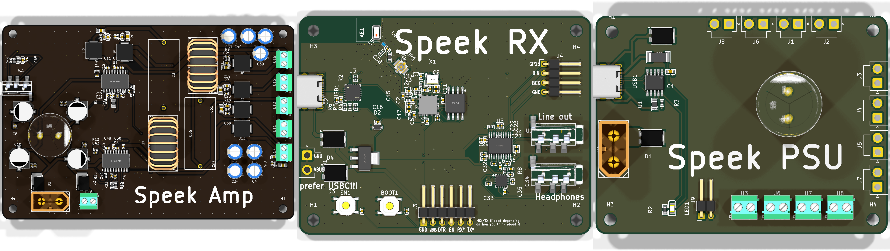

A modular speaker system. Right now, it has a couple of boards:

- Speek Amp: This is the flagship amplifier. It's a hybrid 2.1 design using the TPA3116D2 chip. It's built to handle 4Ω speakers. It outputs lines for a mono subwoofer, two stereo woofers, and two stereo tweeters.
- Speek RX: This is a Bluetooth audio reciever. It runs off of a qfn esp32 D0WD v3 and has a built-in headphone amp, or a normal line out for chaining.
- Speek PSU: This is a supporting PSU board. It has a USB-C PD trigger (for quick tests) and a barrel jack port for proper power (needed to power real flagship drivers). It can be used as a stable power source for pretty much anything. Note that the barrel jack supplies 24V while PD gives 20V. 

On modularity:

- Each board is self-contained and can be used on it's own. However, they can also all be used together. 

**Right now, enclosure design is out of scope. This repo holds just the boards, and the boards are complete**

## \[Please Read\] Where do I find everything? AKA checklist

Why the monorepo?

Because it's one project even though it has multiple boards. idk, Madhav reccommended it.

Checklist:

- [x] A good README
- [x] Source files for your project
    - This includes hardware design, firmware, 3D assemblies, etc
- [x] Production files (if applicable)
    - You'll find gerbers, fabrication BOMs, and PnP files at the following locations:
      - Speek Amp: [speek-amp/PCB/speek_amp/production_real](speek-amp/PCB/speek_amp/production_real)
      - Speek RX: [speek-rx/PCB/speek_rx/production_real](speek-rx/PCB/speek_rx/production_real)
      - Speek PSU: [speek-psu/PCB/speek_psu/production_real](speek-psu/PCB/speek_psu/production_real)
- \[N/A\] JOURNAL.md if journalling on Git
- [x] BOM.csv complete with functioning links (where applicable)
- [x] A short description of what your project is
- [x] A couple sentences on why you made the project
- [x] PICTURES OF YOUR PROJECT
- [x] A screenshot of a full 3D model with your project (see [banner.png](docs/banner.png))
- [x] A screenshot of your PCB, if you have one
- [x] A screenshot of your schematic, if you have one
- [x] A wiring diagram, if you're doing any wiring that isn't on a PCB
- [x] A BOM in table format at the end of the README

## How to use?

Mostly it's plug-and-play after assembling everything. The exception is Speek RX, which requires firmware to be flashed. See [speek-rx/README.md](speek-rx/README.md) for more info, but in short, all you should need to do is

```bash
cd speek-rx
cd firmware
pio run -t upload
```

For wiring your speaker drivers, the silkscreen should coach you through that. 

## Wiring Diagram

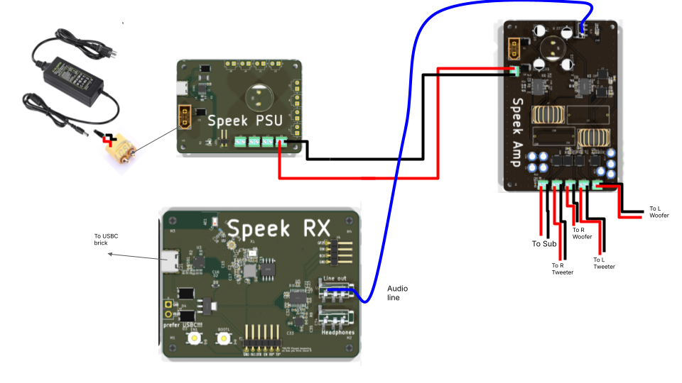

## Gallery

### Speek Amp

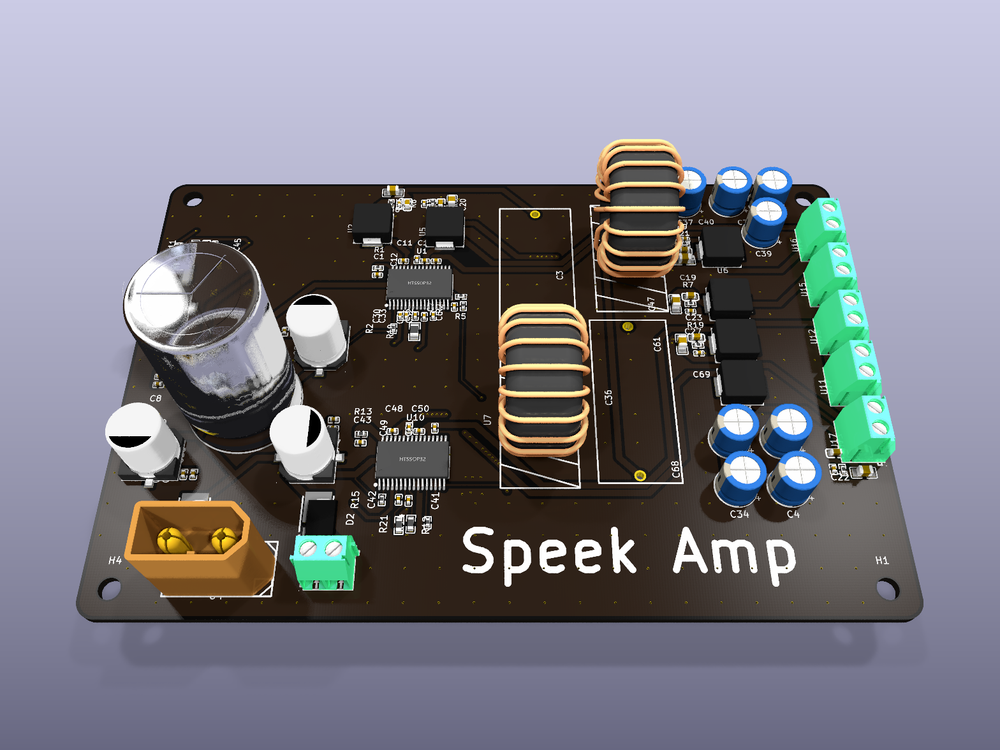

### Speek RX

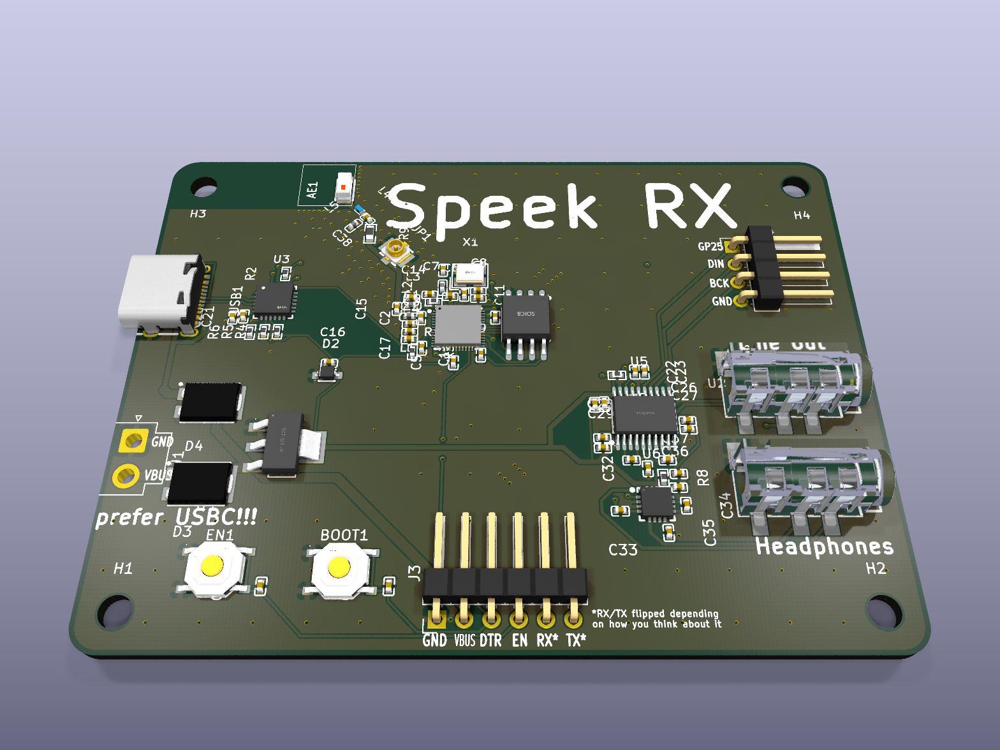

### Speek PSU

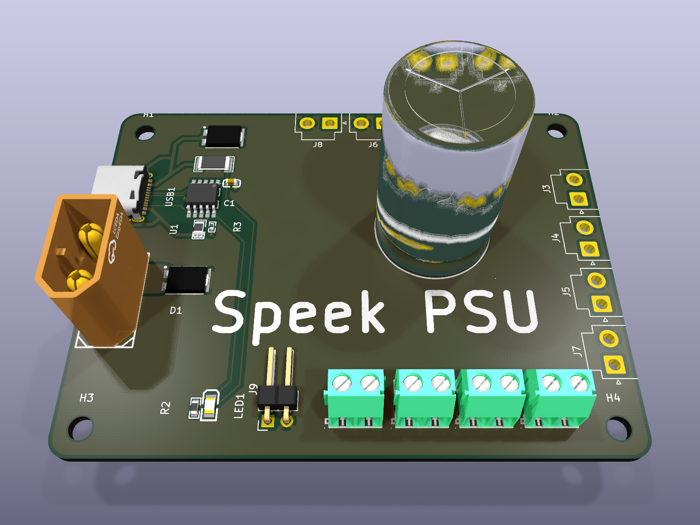

## Schematics

### Speek Amp

[View on KiCanvas](https://kicanvas.org/?repo=https%3A%2F%2Fgithub.com%2FJBlitzar%2Fspeek%2Ftree%2Fmain%2Fspeek-amp%2FPCB%2Fspeek_amp)

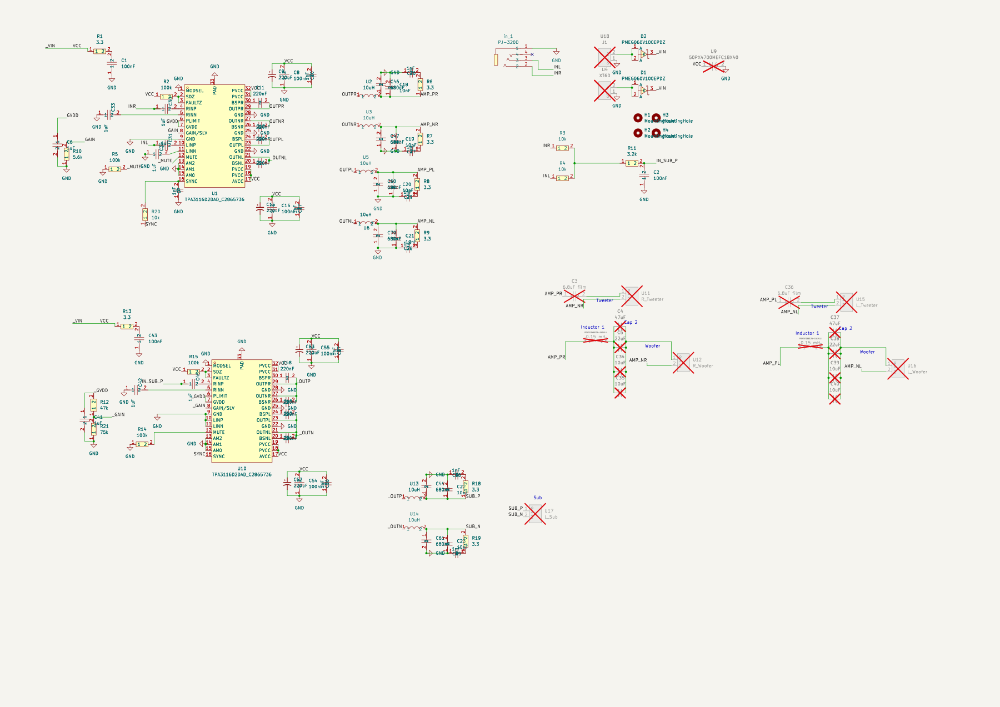

### Speek RX

[View on KiCanvas](https://kicanvas.org/?repo=https%3A%2F%2Fgithub.com%2FJBlitzar%2Fspeek%2Ftree%2Fmain%2Fspeek-rx%2FPCB%2Fspeek_rx)

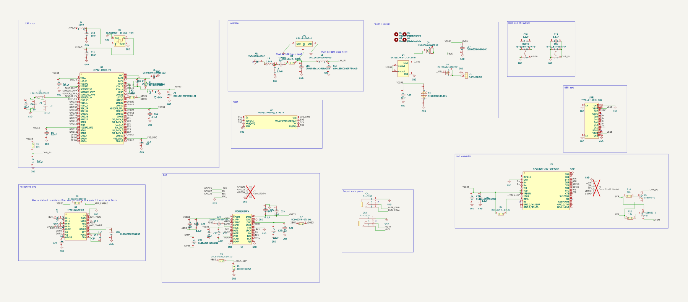

### Speek PSU

[View on KiCanvas](https://kicanvas.org/?repo=https%3A%2F%2Fgithub.com%2FJBlitzar%2Fspeek%2Ftree%2Fmain%2Fspeek-psu%2FPCB%2Fspeek_psu)

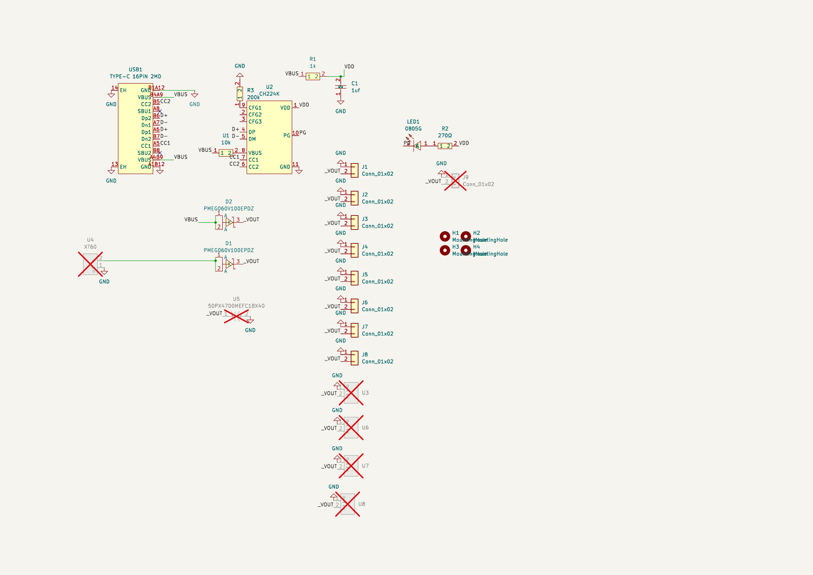

## PCBs

### Speek Amp

[View on KiCanvas](https://kicanvas.org/?repo=https%3A%2F%2Fgithub.com%2FJBlitzar%2Fspeek%2Ftree%2Fmain%2Fspeek-amp%2FPCB%2Fspeek_amp)

| F.Cu | B.Cu |
| --- | --- |
| 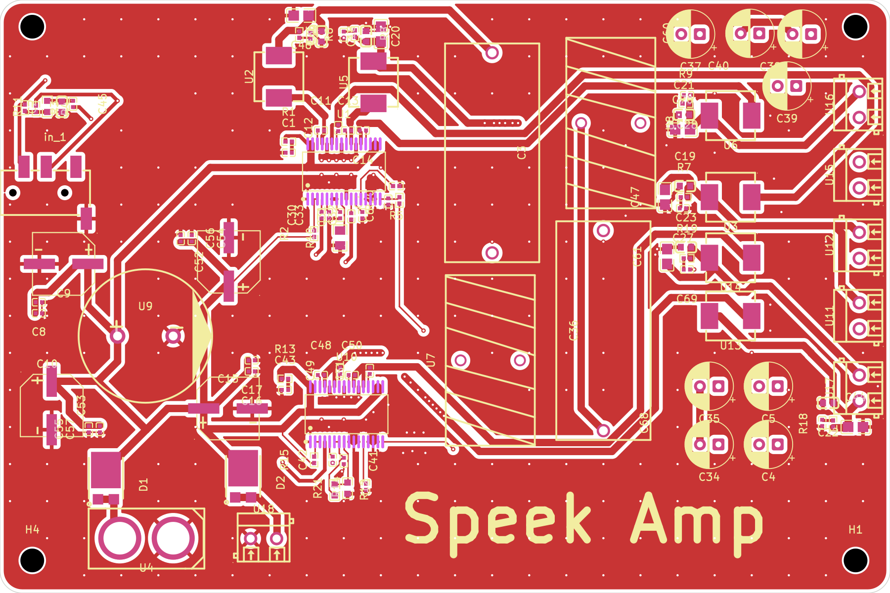 | 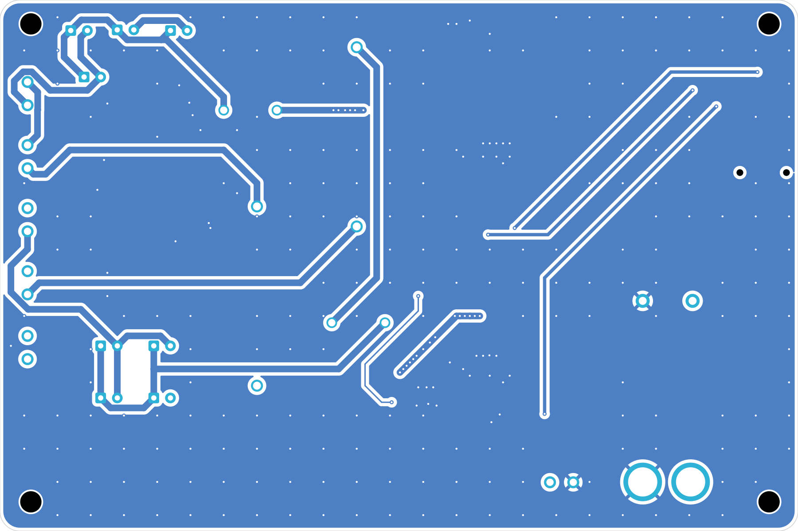 |

### Speek RX

[View on KiCanvas](https://kicanvas.org/?repo=https%3A%2F%2Fgithub.com%2FJBlitzar%2Fspeek%2Ftree%2Fmain%2Fspeek-rx%2FPCB%2Fspeek_rx)

| F.Cu | B.Cu |
| --- | --- |
| 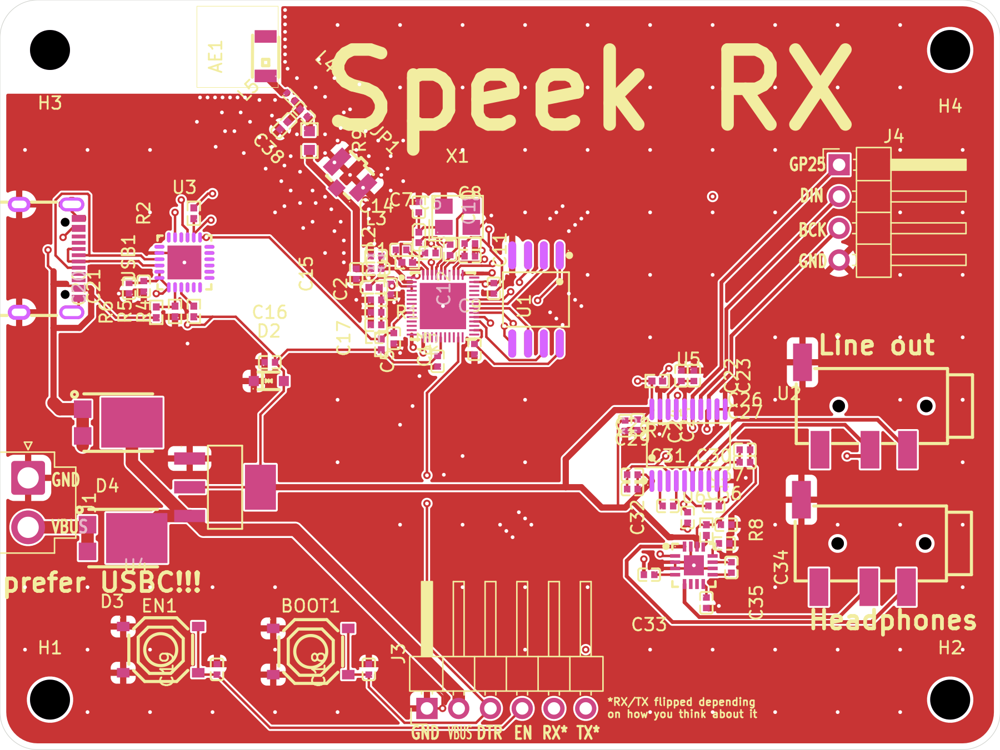 | 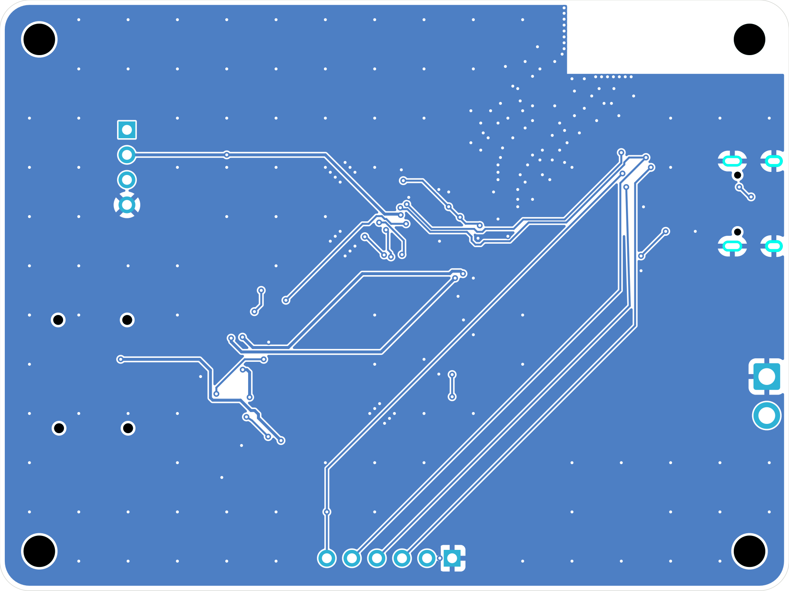 |

### Speek PSU

[View on KiCanvas](https://kicanvas.org/?repo=https%3A%2F%2Fgithub.com%2FJBlitzar%2Fspeek%2Ftree%2Fmain%2Fspeek-psu%2FPCB%2Fspeek_psu)

| F.Cu | B.Cu |
| --- | --- |
| 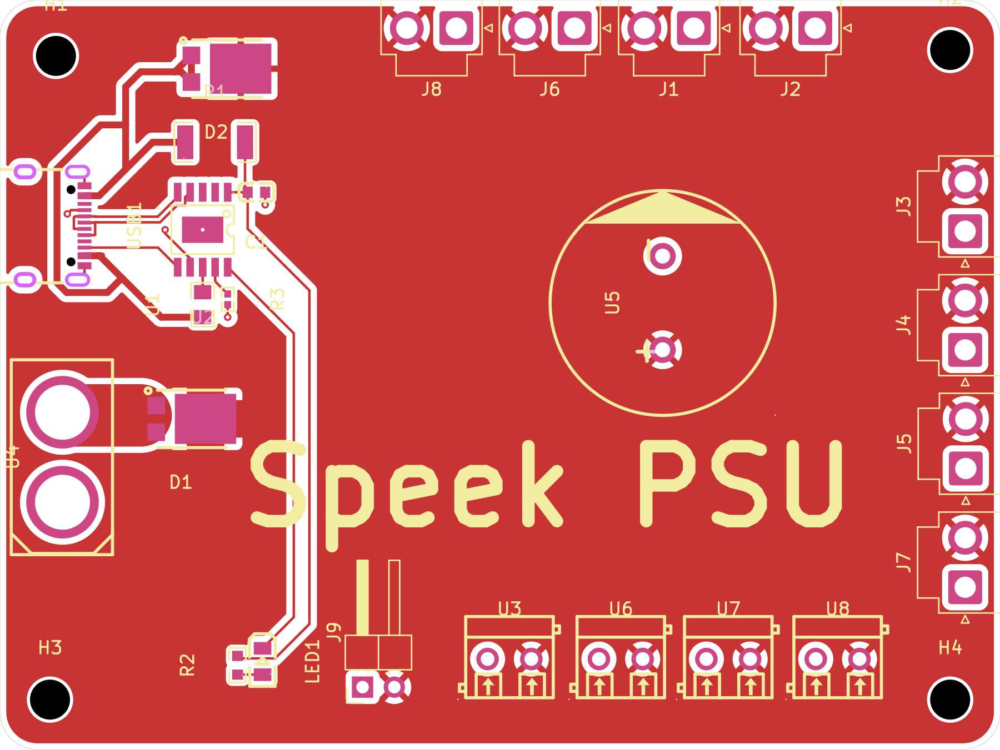 | 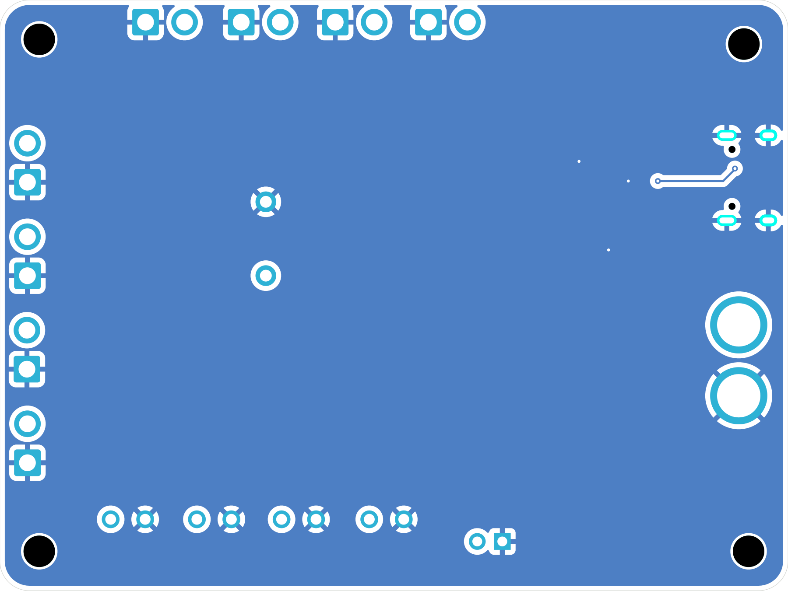 |

## Overall BOM

| Item | Link | Extended Cost | Notes |
| --- | --- | --- | --- |
| Notes | N/A | 0 | Will use some thick wire (already own) for all PSU bodge jobs. Speek RX must be 1mm thick PCB for antenna impedence matching! Subwoofer needs 1 cubic foot enclosure. |
| U.FL antenna | TBD | 0 | get this if the ceramic antenna doesnt work |
| 24v 6A PSU | https://www.amazon.com/Supply-Adapter-100-240V-Transformers-Security/dp/B0CGHSTDYM | 16 |  |
| XT60 male | https://www.lcsc.com/product-detail/C98733.html | 5 |  |
| XT60 female | https://www.lcsc.com/product-detail/C98734.html | 5 |  |
| JST VH connectors | https://www.amazon.com/pzsmocn-Extension-Accessories-Connector-Pre-Crimped/dp/B0DNPY3G91/ | 10 |  |
| preliminary subwoofer | https://www.parts-express.com/GRS-8SW-4-8-Poly-Cone-Subwoofer-4-Ohm-292-480?quantity=1 | 24 | Gamut runs $20 thru $50: see https://www.parts-express.com/speaker-components/hi-fi-woofers-subwoofers-midranges-tweeters/subwoofer-drivers/nominaldiameter/5-1--SLASH--4,6,6-1--SLASH--2,8?order=base_price:asc&base_price=0.00to78.49 ; pay $50 for fancier one https://www.parts-express.com/Dayton-Audio-SD215A-88-8-DVC-Subwoofer-295-484?quantity=1 |
| preliminary 2x woofers | https://www.parts-express.com/6-1-2-Poly-Cone-Woofer-4-Ohm-299-609?quantity=1 | 19.96 | https://www.parts-express.com/reviewrating/4to5?order=custitem_pe_search_ranking:desc&keywords=woofers&base_price=0.00to40.81 . More expensive non-buyout option is https://www.parts-express.com/GRS-8PR-8-8-Poly-Cone-Rubber-Surround-Woofer-292-428?quantity=1 |
| preliminary 2x tweeters | https://www.parts-express.com/Dayton-Audio-ND20FA-6-3-4-Soft-Dome-Neodymium-Tweeter-275-030?quantity=1 | 21.96 | https://www.parts-express.com/reviewrating/4to5?keywords=tweeter&base_price=0.00to24.71 ; There exists a $4 per listing |
| 47uF caps | https://www.lcsc.com/product-detail/C397097.html | 0.76 | Buying straight from LCSC to hand-solder instead of PCBAing |
| 22uF caps | https://www.lcsc.com/product-detail/C216548.html | 0.53 | Buying straight from LCSC to hand-solder instead of PCBAing |
| 10uF caps | https://www.lcsc.com/product-detail/C192100.html | 0.74 | Buying straight from LCSC to hand-solder instead of PCBAing |
| 6.8uF film caps | https://www.lcsc.com/product-detail/C21390242.html | 1.87 | Buying straight from LCSC to hand-solder instead of PCBAing |
| 1mH inductor | https://www.lcsc.com/product-detail/C53190548.html | 2.81 | Buying straight from LCSC to hand-solder instead of PCBAing |
| 220uH inductor | https://www.lcsc.com/product-detail/C22358491.html | 0.97 | Buying straight from LCSC to hand-solder instead of PCBAing |
| 150uH inductor | https://www.lcsc.com/product-detail/C3011544.html | 1.02 | Buying straight from LCSC to hand-solder instead of PCBAing |
| 2x 4700uF cap | https://www.lcsc.com/product-detail/C5115284.html | 3.86 | Buying straight from LCSC to hand-solder instead of PCBAing |
| 10x screw terminal | https://www.lcsc.com/product-detail/C695629.html | 0.84 | Buying straight from LCSC to hand-solder instead of PCBAing |
| Total |  | 115.32 |  |

## Fabrication BOMs

> LCSC part numbers missing? Don't worry, it's a DNP component that I'll hand solder myself. It's in the table above.

### Speek Amp

| Designator | Footprint | Quantity | Value | LCSC Part # |
| --- | --- | --- | --- | --- |
| C1, C16, C43, C54, C55, C8 | C0402 | 6 | 100nF | C60474 |
| C10, C17, C26, C27, C28, C29, C56, C57, C68, C69, C7 | C0402 | 11 | 1nF | C14442 |
| C11, C12, C13, C14, C48, C49, C50, C51 | C0402 | 8 | 220nF | C16772 |
| C15, C52, C53, C9 | CAP-SMD_BD8.0-L8.3-W8.3-FD | 4 | 220uF | C178534 |
| C18, C19, C20, C21, C22, C23 | C0603 | 6 | 10nF | C100042 |
| C2 | C0603 | 1 | 100nF | C14663 |
| C3, C36 | CAP-TH_L29.5-W12.7-P27.00-D0.8 | 2 | 6.8uF film | C21390242 |
| C30, C31, C32, C33, C41, C42, C45, C6 | C0402 | 8 | 1uF | C22399609 |
| C34, C35, C39, C40 | CP_Radial_D6.3mm_P2.50mm | 4 | 10uF |  |
| C37, C4 | CP_Radial_D6.3mm_P2.50mm | 2 | 47uF |  |
| C38, C5 | CP_Radial_D6.3mm_P2.50mm | 2 | 22uF |  |
| C44, C46, C47, C60, C61, C70 | C0805 | 6 | 680nF | C107133 |
| D1, D2 | SOT1289_L5.8-W4.4-LS6.5-RD | 2 | PMEG060V100EPDZ | C552792 |
| IN_1 | AUDIO-SMD_PJ-320D-1 | 1 | PJ-320D | C431535 |
| R1, R13, R18, R19, R6, R7, R8, R9 | R0402 | 8 | 3.3 | C137986 |
| R10 | R0805 | 1 | 5.6k | C4382 |
| R11 | R0603 | 1 | 3.2k | C861375 |
| R12 | R0603 | 1 | 47k | C2907042 |
| R14, R15, R2, R5 | R0402 | 4 | 100k | C60491 |
| R20, R3, R4 | R0402 | 3 | 10k | C60490 |
| R21 | R0603 | 1 | 75k | C23242 |
| U1, U10 | HTSSOP-32_L11.0-W6.1-P0.65-LS8.1-BL | 2 | TPA3116D2DAD_C2865736 | C2865736 |
| U11 | CONN-TH_DB301V-3.5-2P-GN | 1 | R_Tweeter | C695629 |
| U12 | CONN-TH_DB301V-3.5-2P-GN | 1 | R_Woofer | C695629 |
| U13, U14, U2, U3, U5, U6 | IND-SMD_L7.2-W6.6_GPSR07X0 | 6 | 10uH | C5189958 |
| U15 | CONN-TH_DB301V-3.5-2P-GN | 1 | L_Tweeter | C695629 |
| U16 | CONN-TH_DB301V-3.5-2P-GN | 1 | L_Woofer | C695629 |
| U17 | CONN-TH_DB301V-3.5-2P-GN | 1 | L_Sub | C695629 |
| U18 | CONN-TH_DB301V-3.5-2P-GN | 1 | J1 | C695629 |
| U4 | CONN-TH_XT60 | 1 | XT60 | C98733 |
| U7, U8 | IND-TH_L23.0-W12.0-P8.00-D0.8 | 2 | PDMTAT068125-151MLU | C3011544 |
| U9 | CAP-TH_BD18.0-P7.50-D0.8-FD | 1 | 50PX4700MEFC18X40 | C5115284 |

### Speek RX

| Designator | Footprint | Quantity | Value | LCSC Part # |
| --- | --- | --- | --- | --- |
| AE1 | ANT-SMD_L3.2-W1.6 | 1 | 2450AT18A100E | C89334 |
| BOOT1, EN1 | SW-SMD_4P-L5.1-W5.1-P3.70-LS6.5-TL_H1.5 | 2 | TS-1187A-B-A-B | C318884 |
| C1, C13, C32, C33, C34, C35, C8 | C0402 | 7 | 1uF | C52923 |
| C10, C11 | C0402 | 2 | 15pf | C1548 |
| C12, C17, C18, C19, C2, C20, C22, C25, C26, C29, C3, C5 | C0402 | 12 | 0.1uF | C1525 |
| C14 | C0402 | 1 | GRM1555C1H2R7BA01D | C88928 |
| C15 | C0402 | 1 | GRM1555C1H2R0BA01D | C85937 |
| C16, C23, C24, C27, C28, C4 | C0402 | 6 | 10uF | C15525 |
| C21 | C0402 | 1 | CL05A475KP5NRNC | C23733 |
| C30, C31, C36, C37 | C0402 | 4 | CL05A225KO5NQNC | C170151 |
| C38 | C0402 | 1 | 1pF | C29266 |
| C6 | C0402 | 1 | CC0402KRX7R9BB103 | C15195 |
| C7 | C0402 | 1 | CC0402KRX7R9BB332 | C26404 |
| C9 | C0402 | 1 | CC0402JRNPO9BN101 | C1546 |
| CN1, CN2 | AUDIO-SMD_PJ-320D-1 | 2 | PJ-320D | C431535 |
| D2 | SOD-323_L1.7-W1.3-LS2.5-BI-1 | 1 | PESD3V3L1BA,115 | C51450 |
| D3, D4 | SOT1289_L5.8-W4.4-LS6.5-RD | 2 | PMEG060V100EPDZ | C552792 |
| J1 | JST_VH_B2P-VH-B_1x02_P3.96mm_Vertical | 1 | Conn_01x02 |  |
| J3 | PinHeader_1x06_P2.54mm_Horizontal | 1 | Conn_01x06_Socket |  |
| J4 | PinHeader_1x04_P2.54mm_Horizontal | 1 | Conn_01x04 |  |
| JP1 | RF-SMD_FRF05002-JSS103M | 1 | U.FL-R-SMT-1 | C88374 |
| L1 | L0402 | 1 | LQG15HS2N0S02D | C18216 |
| L2 | L0402 | 1 | 15nH | C27143 |
| L3 | L0402 | 1 | LQG15HS2N7S02D | C77108 |
| L4 | IND-SMD_L1.0-W0.5-2 | 1 | 3.9nH | C98062 |
| L5 | L0402 | 1 | 2.7nH | C77108 |
| R1 | R0402 | 1 | RC-02K2002FT | C25765 |
| R2 | R0402 | 1 | 499Ω | C2960788 |
| R3, R7 | R0402 | 2 | RC0402FR-0710KL | C25744 |
| R4 | R0402 | 1 | RC0402FR-071KL | C11702 |
| R5 | R0402 | 1 | AR02DTD4752 | C319604 |
| R6 | R0402 | 1 | CRCW040222K1FKED | C844504 |
| R8 | R0402 | 1 | 0402WGF0000TCE | C17168 |
| R9 | R0603 | 1 | RC0603JR-070RL | C22966 |
| U1 | QFN-48_L5.0-W5.0-P0.35-BL-EP3.7 | 1 | ESP32-D0WD-V3 | C967021 |
| U2 | SOIC-8_L5.3-W5.3-P1.27-LS8.0-BL | 1 | W25Q32JVSSIQ_C179173 | C179173 |
| U3 | QFN-24_L4.0-W4.0-P0.50-TL-EP2.6 | 1 | CP2102N-A02-GQFN24R | C969151 |
| U4 | SOT-223-4_L6.5-W3.5-P2.30-LS7.0-BR | 1 | SPX1117M3-L-3-3/TR | C6862 |
| U5 | TSSOP-20_L6.5-W4.4-P0.65-LS6.4-BL | 1 | PCM5102APW | C1520792 |
| U6 | WQFN-16_L3.0-W3.0-P0.50-TL-EP1.6 | 1 | TPA6132A2RTER | C69901 |
| USB1 | USB-C-SMD_TYPE-C-16PIN-2MD-073 | 1 | TYPE-C 16PIN 2MD | C2765186 |
| X1 | CRYSTAL-SMD_4P-L3.2-W2.5-BL | 1 | XL2EL89CPI-111YLC-40M | C5444549 |

### Speek PSU

| Designator | Footprint | Quantity | Value | LCSC Part # |
| --- | --- | --- | --- | --- |
| C1 | C0603 | 1 | 1uf | C1592 |
| D1, D2 | SOT1289_L5.8-W4.4-LS6.5-RD | 2 | PMEG060V100EPDZ | C552792 |
| J1, J2, J3, J4, J5, J6, J7, J8 | JST_VH_B2P-VH-B_1x02_P3.96mm_Vertical | 8 | Conn_01x02 |  |
| J9 | PinHeader_1x02_P2.54mm_Horizontal | 1 | Conn_01x02 |  |
| LED1 | LED0805-R-RD | 1 | 0805G | C2297 |
| R1 | R2010 | 1 | 1k | C2974087 |
| R2 | R0603 | 1 | 270Ω | C22966 |
| R3 | R0402 | 1 | 200k | C25764 |
| U1 | R0805 | 1 | 10k | C2907219 |
| U2 | ESSOP-10_L4.9-W3.9-P1.0-LS6.0-TL-EP | 1 | CH224K | C970725 |
| U3, U6, U7, U8 | CONN-TH_DB301V-3.5-2P-GN | 4 | ~ | C695629 |
| U4 | CONN-TH_XT60 | 1 | XT60 | C98733 |
| U5 | CAP-TH_BD18.0-P7.50-D0.8-FD | 1 | 50PX4700MEFC18X40 | C5115284 |
| USB1 | USB-C-SMD_TYPE-C-16PIN-2MD-073 | 1 | TYPE-C 16PIN 2MD | C2765186 |
